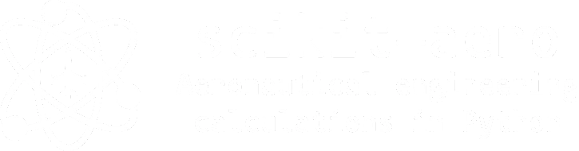

# Scikit-aero



[](https://python.org)
[](LICENSE)
[](https://scikit-aero.readthedocs.io/)
[](https://codecov.io/gh/AeroPython/scikit-aero)

A Python package for aeronautical engineering calculations with support for parametric aircraft design.

## Features

- Pythonic interface with modern type hints
- SI units support through Pint
- Full NumPy array support
- Standard atmosphere properties up to 86 kilometers
- Gas dynamics calculations
- Aircraft parametric design equations (Raymer)
- Fully tested and documented

## Installation

```bash
pip install scikit-aero
```
## Quick Start

```python
    import skaero.atmosphere as atm
    import skaero.gasdynamics as gd
    # Get atmospheric properties at 10km
    h = 10000 # meters
    atmosphere = atm.coesa.table(h)
    print(f"Temperature at {h}m: {atmosphere.temperature:.2f} K")
    # Calculate isentropic flow properties
    flow = gd.isentropic.IsentropicFlow(gamma=1.4)
    mach = 2.0
    print(f"Pressure ratio at M={mach}: {flow.p_p0(mach):.3f}")
    # Parametric design example
    from skaero.design import raymer
    wing = raymer.Wing(aspect_ratio=8.0, sweep=25.0)
    print(f"Wing weight fraction: {wing.weight_fraction():.3f}")
```


## Documentation

Full documentation is available at [scikit-aero.readthedocs.io](https://scikit-aero.readthedocs.io/).

The documentation includes:
- API Reference
- Theory Guide
- Examples & Tutorials
- Contributing Guidelines

## Development

To set up a development environment:
```bash
git clone https://github.com/AeroPython/scikit-aero.git
cd scikit-aero
pip install -e ".[dev]"
```

To run tests:
```bash
pytest
```


## Contributing

Contributions are welcome! Please feel free to submit a Pull Request. Some areas we're looking to improve:

- Additional parametric design equations from Raymer
- More aircraft design examples
- Performance improvements
- Documentation enhancements

## License

scikit-aero is released under a BSD license. See the [LICENSE](LICENSE) file for details.

## Citation

If you use scikit-aero in your research, please cite:

```bibtex
@software{scikit_aero,
author = {Cano, Juan Luis and Doty, Andrew James and Hom, Dennis},
title = {scikit-aero: Aeronautical engineering calculations in Python},
year = {2024},
publisher = {GitHub},
url = {https://github.com/AeroPython/scikit-aero}
}
```
